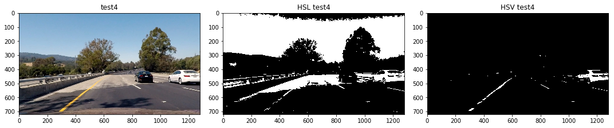
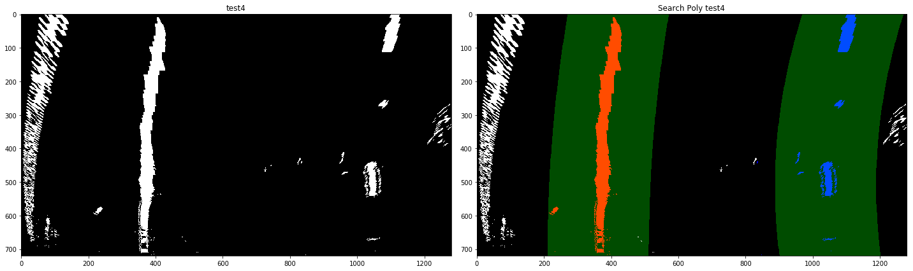

# Advanced Lane Finding
[](http://www.udacity.com/drive)

Overview
---

This particular project leverages the ideas and knowledge from the previous project.  Here, instead of focusing on only Canny Edge Detection, we learnt more about using `color spaces` and how to identify the appropriate channel for isolating lines.  Additionally we are introduced to `Sobel` and how it introduces flexibilty in identifying lane lines.  

The project rubric for this project can be found [project rubric](https://review.udacity.com/#!/rubrics/1966/view). 

Table of Contents
---

1.  [Getting Started](#getting-started)  
2.  [Camera  Calibration](#camera-calibration)
3.  [Filtering Image](#filtering-image)
4.  [Perspective Transformation](#perspective-transformation)
5.  [Fitting Line](#fitting-line)
6.  [Pipeline](#pipeline)
7. [Reflection](#reflection)

Getting Started
---

Firstly, setup the environment according to this [CarND-Term1-Starter-Kit](https://github.com/udacity/CarND-Term1-Starter-Kit), from which I installed the GPU version of the environment.

All of codes written here are referenced from the classrooms of this particular project **Advanced Lane Finding**.  To ensure that the pipeline will be able to detect lane lines even better, the workflow for this project is:

1.  Calibrate the camera to fix for distortions in a camera
2.  Use Sobel and Color space isolation for identifying lines better
3.  Use Perspective transform to clearly visualize lanes
4.  Fit a 2D polynomial for the lanes
5.  Calculate for real world metrics (Curvature of lanes)
6.  Fit all alogrithms into a pipeline

Camera Calibration
---

As an initial start, all cameras in the world will have some sort of distortion when taking photos or images.  This is usually due to the nature of the lens on the camera on which it was taken.  However `OpenCV` provides an handy tool `cv2.findChessboardCorners()` and `cv2.calibrateCamera()`.  How this works is first, take a couple of sample pictures of any chessboard (already provided by UDACITY) and use the `cv2.findChessBoardCorners()` to return all the corners it finds in the image and append to a list.  After which the `cv2.calibrateCamera()` is used in order to return the camera matrix and distortion coefficient in order to calibrate all incoming images for a particular source.  The following is the function used in order calibrate the camera.

```python
def calibrate():
    
    nx = 9
    ny = 6
    
    objp = np.zeros((ny*nx,3),np.float32)
    objp[:,:2] = np.mgrid[0:nx,0:ny].T.reshape(-1,2)  
    
    objpoints = []
    imgpoints = []
    
    images = glob.glob('camera_cal/calibration*.jpg')
    img_shape = []
    
    for fname in images:
        
        img = cv2.imread(fname)
        gray = cv2.cvtColor(img,cv2.COLOR_BGR2GRAY)
        
        if len(img_shape)<1:
            img_shape = gray.shape[::-1]
            
        ret, corners = cv2.findChessboardCorners(gray,(nx,ny),None)
    
        if ret == True:
            objpoints.append(objp)
            imgpoints.append(corners)
    
    ret, mtx, dist, rvecs, tvecs = cv2.calibrateCamera(objpoints,imgpoints,img_shape,None,None)
    
    return mtx, dist

def undistort(img,mtx,dist):
    
    return cv2.undistort(img,mtx,dist,None,mtx)
```
 
<center>

Calibrated Chessboard              |
:---------------------------------:|
  |

Undistorted Car Image              |
:---------------------------------:|
  |    

</center>

    
Filtering Image
---

### Color space

Following the calibration, we will dive into a new filtering or isolating method for identifying lanes easier.  The first is to determine which color space is most efficient in separating lines.  I chose to use the HSV and HSL color space in and separate only the 3rd channel, the *lightness* channel for HSL and *value* channel for HSV. 

<center>
    
HSL Color Space            |  HSV Color Space
:-------------------------:|:-------------------------:
  |  
    
</center>

From the images above, **HSL** images will retain the pixels where the **L Channel threshold** is within 160 - 255 and ** HSV images will retain pixles where the **V Channel** is within 230 - 255.  This would mean that from **HSL** images, bright colors and tones of white to black (gray) will be retained while **HSV** images will retain bright colors and it's different shades.

The code demonstrates how this is achieved and a few samples of its results

```python
def separateChannel(img,channel = 2,thresh = [200,255]):
    """
    returns a specified range in a single channel of an image
    
    input: an image in any Color Space.
    
    output: a specified range in a single channel of an image
    """
    
    channel = img[:,:,channel]
    
    sbinary = np.zeros_like(channel)
    sbinary[(channel>=thresh[0]) & (channel<=thresh[1])] = 1
    
    return sbinary


def combine_colorSpace(img1,img2):
    
    combined_color = np.zeros_like(img1)
    combined_color[(img1==1) | (img2==1)] = 1
    
    return combined_color
```

  
  
  
  

Isolating from the **HSV** image seems to give the best lane line with the least noise between the 2.

### Sobel Operator

However, this was not enough which is why `Sobel` was introduced as well in order to reinforce detecting lane lines.  Unlike Canny Edge Detection, Sobel is more robust, in which it calculates the derivate across pixels in only **1 Direction**.  The image below will give an idea of how a derivate in the x-axis and y-axis can vary.  For more information, the following posts could prove helpful.  
- [Understanding Edge Detection](https://medium.com/datadriveninvestor/understanding-edge-detection-sobel-operator-2aada303b900) 
- [Sobel Tutorial](https://docs.opencv.org/3.4/d2/d2c/tutorial_sobel_derivatives.html)  

<center>

Sobel Operator             |
:---------------------------------:|
  |

</center>

After which we use 2 different methods to approximate the gradient in a particular pixel by combining the two.

<center>
    
Magnitude           |  Simple Magnitude
:-------------------------:|:-------------------------:
  |  
    
</center>

This is implemented in the code as and the result is as follows:

```python
def abs_sobelx_thresh(img, ksize=3, thresh=(30,50)):

    gray = convert_gray(img)

    sobelx = cv2.Sobel(gray,cv2.CV_64F,1,0,ksize=ksize)
    
    abs_sobelx = np.absolute(sobelx)
    
    scaled_sobelx = np.uint8(255*abs_sobelx/np.max(abs_sobelx))
    
    sbinary = np.zeros_like(scaled_sobelx)
    sbinary[(scaled_sobelx>=thresh[0]) & (scaled_sobelx<thresh[1])] = 1
    
    return sbinary

def mag_sobel_thresh(img,ksize=9,thresh= (60,100)):
    
    gray = convert_gray(img)

    Sobelx = cv2.Sobel(gray,cv2.CV_64F,1,0,ksize=ksize)
    Sobely = cv2.Sobel(gray,cv2.CV_64F,0,1,ksize=ksize)
    
    abs_sobelxy = np.sqrt(Sobelx**2+Sobely**2)
    scaled_sobel = np.uint8(255*abs_sobelxy/np.max(abs_sobelxy))
    
    mag_binary = np.zeros_like(scaled_sobel)
    mag_binary[(scaled_sobel>=thresh[0]) & (scaled_sobel<=thresh[1])] = 1  
    
    return mag_binary

def dir_sobel_thresh(img,ksize=15,thresh= (0.7,1.3)):
    
    gray = convert_gray(img)

    Sobelx = cv2.Sobel(gray,cv2.CV_64F,1,0,ksize=ksize)
    Sobely = cv2.Sobel(gray,cv2.CV_64F,0,1,ksize=ksize)
    
    abs_sobelx = np.absolute(Sobelx)
    abs_sobely = np.absolute(Sobely)
    
    direction = np.arctan2(abs_sobely,abs_sobelx)

    sbinary = np.zeros_like(direction)
    sbinary[(direction>=thresh[0]) & (direction<=thresh[1])] = 1  
    
    return sbinary
```

  
  
  
  

Combing all of the results of Sobel seems to be the best choice.

### Combining the results

After finding that **HSV V channel** provides the least noise and a combination of **Sobel gradients** seems to be a good choice, I have decided to use combine both the results in order to create the best possible lane line.  The results looks promising!

  
  
  
  

Perspective Transformation
---

As we've seen from the first project *Finding Lane Lines* we can see that no matter how well we are able to identify lines in an image, we will still only be able to detect/categorize lines as a straight line.  It is needed for the lines to be plotted as a 2D polynomial so it is able to identify turns.  This is where we will use `cv2.getPerspectiveTransform()` and `cv2.warpPerspective()` to replicate a **Birds Eye View** image of the road.  This allows us to easily fit and determine the curve of the line with a 2D polynomial.

```python
def transformation_matrix(img):
    
    src = roi(img)
    
    img_size = (img.shape[1],img.shape[0])
    
    offset = 300
    x1 = offset
    x2 = img_size[0]-offset
    
    y1 = 0
    y2 = img_size[1]
    
    corner1 = [[x1,y1]]
    corner2 = [[x2,y1]]
    corner3 = [[x1,y2]]
    corner4 = [[x2,y2]]

    des = np.array([corner1,corner2,corner3,corner4],dtype=np.float32)
    M = cv2.getPerspectiveTransform(src,des)
    Minv = cv2.getPerspectiveTransform(des,src)
    
    return M , Minv
    
def warp(img,Matrix):
    
    img_size = (img.shape[1],img.shape[0])
    
    return cv2.warpPerspective(img,Matrix,img_size)

```

The resulting images shows the image transformation being implemented successfully.

    
    
    
    

Fitting Line
---

After being able successful in creating warping the image into a **Birds Eye View**, a 2D polynomial can be fitted to accurately depict the curvature of the lane lines.  

Firstly, to be able to fit a 2D polyomial, a cluster of points or *good indices* will need to be identified.  This can be done with the function `sliding_window()` as it will search for a base to start from then gently proceed towards the top of the image (further from car) in order to identify the *good indices* that make up a lane line.

```python
def sliding_window(img, nwindows = 21, margin = 70, minpix = 80):
    
    out_img = np.dstack((img, img, img))*255
    
    window_height = np.int(img.shape[0]//nwindows)
    nonzero = img.nonzero()
    nonzerox = np.array(nonzero[1])
    nonzeroy = np.array(nonzero[0])
    
    leftx_current, rightx_current = starting_base(img)
    
    left_lane_inds = []
    right_lane_inds = []
    
    for window in range(nwindows):
        
        y_low = img.shape[0] - (window+1)*window_height
        y_high = img.shape[0] - window*window_height
        
        xleft_low = leftx_current - margin
        xleft_high = leftx_current + margin
        xright_low =rightx_current - margin 
        xright_high = rightx_current + margin
        
        #cv2.rectangle(out_img,(xleft_low,y_low),(xleft_high,y_high),(0,255,0),2)
        #cv2.rectangle(out_img,(xright_low,y_low),(xright_high,y_high),(0,255,0),2)
        
        good_left_inds = ((nonzeroy>=y_low) & (nonzeroy<y_high) &
                          (nonzerox>=xleft_low) & (nonzerox<xleft_high)).nonzero()[0]
        
        good_right_inds = ((nonzeroy>=y_low) & (nonzeroy<y_high) &
                           (nonzerox>=xright_low) & (nonzerox<xright_high)).nonzero()[0]
        
        left_lane_inds.append(good_left_inds)
        right_lane_inds.append(good_right_inds)
        
        if len(good_left_inds)>minpix:
            leftx_current = np.int(np.mean(nonzerox[good_left_inds]))
        if len(good_right_inds)>minpix:
            rightx_current = np.int(np.mean(nonzerox[good_right_inds]))
    
    try:
        left_lane_inds = np.concatenate(left_lane_inds)
        right_lane_inds = np.concatenate(right_lane_inds)
    except ValueError:
        pass

    leftx = nonzerox[left_lane_inds]
    lefty = nonzeroy[left_lane_inds] 
    rightx = nonzerox[right_lane_inds]
    righty = nonzeroy[right_lane_inds]

    return leftx, lefty, rightx, righty, out_img 
        
def fit_polynomial(img,plot_onImage = False):
    
    leftx, lefty, rightx, righty, out_img = sliding_window(img)

    left_fit = np.polyfit(lefty,leftx,2)
    right_fit = np.polyfit(righty,rightx,2)

    ploty = np.linspace(0, img.shape[0]-1, img.shape[0] )
    try:
        left_fitx = left_fit[0]*ploty**2 + left_fit[1]*ploty + left_fit[2]
        right_fitx = right_fit[0]*ploty**2 + right_fit[1]*ploty + right_fit[2]
    except TypeError:
        print('The function failed to fit a line!')
        left_fitx = 1*ploty**2 + 1*ploty
        right_fitx = 1*ploty**2 + 1*ploty

    ##Visualization
    out_img[lefty, leftx] = [255, 0, 0]
    out_img[righty, rightx] = [0, 0, 255]
    
    if plot_onImage == True:
        for i in range(0,len(ploty)-1):
            cv2.line(out_img,(int(left_fitx[i]),int(ploty[i])),(int(left_fitx[i+1]),int(ploty[i+1])),(255,255,0),4)
            cv2.line(out_img,(int(right_fitx[i]),int(ploty[i])),(int(right_fitx[i+1]),int(ploty[i+1])),(255,255,0),4)
    else:
        
        plt.plot(left_fitx, ploty, color='yellow')
        plt.plot(right_fitx, ploty, color='yellow')
    
    return out_img
```

This showed promising results in detecting the lane line as shown below.

    
    
    
    

However, it would be inefficient to keep repeating this process everytime an image is received.  Hence, a search will start from the place where the previous frame's polynomial line ended.  This is better because as images are fed into the computer of the car at more than 1 frame per sec, the lane lines between the previous and current frame would be in around the same area.

The only part that would need to be changed is first initializing a polynomial to start from (this will be kept for memory).

```python
left_fit = np.array([ 2.13935315e-04, -3.77507980e-01,  4.76902175e+02])
right_fit = np.array([4.17622148e-04, -4.93848953e-01,  1.11806170e+03])
```

Then extrapolate the polynimial on the next incoming image to find *good indices* and lastly, use the same procedure to fit the 2D polynomial again (where we update the polynomial fits in memory).

```python
def fit_poly(img_shape, leftx, lefty, rightx, righty):

    ploty = np.linspace(0, img_shape[0]-1,img_shape[0])
    left_fit = np.polyfit(lefty,leftx,2)
    right_fit = np.polyfit(righty,rightx,2)
    
    return left_fit,right_fit, ploty

def search_around_poly(img,margin = 150):
    
    nonzero = img.nonzero()
    nonzerox = np.array(nonzero[1])
    nonzeroy = np.array(nonzero[0])
    
    lx = left_fit[0]*(nonzeroy**2) + left_fit[1]*nonzeroy + left_fit[2]
    rx = right_fit[0]*(nonzeroy**2) + right_fit[1]*nonzeroy + right_fit[2] 
    
    left_lane_inds = ((nonzerox>(lx-margin)) & (nonzerox<(lx+margin)))
    right_lane_inds = ((nonzerox>(rx-margin)) & (nonzerox<(rx+margin)))
    
    leftx = nonzerox[left_lane_inds]
    lefty = nonzeroy[left_lane_inds] 
    rightx = nonzerox[right_lane_inds]
    righty = nonzeroy[right_lane_inds]
    
    left_f, right_f, ploty = fit_poly(img.shape, leftx, lefty, rightx, righty)
    
    ...
    ...
    
    return result
```

This completes all the necessary tools to build the pipeline.

    
    
    
  

Pipeline
---

After knowing all the relevant functions work, all them were added the class `Line` in order to store all the variables that will be needed.  Furthermore, 1 addition was made to the function that fit the 2D polynomial.  The addition serves as a kind of filter to smoothen out the transition from previous to current polynomial as show in the code below:

```python
def fit_line(self,img,leftx,lefty,rightx,righty):
        
    ploty = np.linspace(0, img.shape[0]-1, img.shape[0] )
        
    self.current_fit_left = np.polyfit(lefty,leftx,2)
    self.current_fit_right = np.polyfit(righty,rightx,2)
        
    alpha = 0.2
        
    if self.detected == False:
        self.best_fit_left = self.current_fit_left 
        self.best_fit_right = self.current_fit_right
            
    else:
            
        self.best_fit_left = self.best_fit_left*(1-alpha) + self.current_fit_left*alpha 
        self.best_fit_right = self.best_fit_right*(1-alpha) + self.current_fit_right*alpha 
    ....
    return ....    
```

Also 2 changes were included to calculate for the real world metrics or curvature of the lane line by translating the pixels to meters.

```python
def curvature_lane(self,ploty,left_fitx,right_fitx):
        
    y_eval = np.max(ploty)
        
    left_fit_cr = np.polyfit(ploty*self.ym_per_pix,left_fitx*self.xm_per_pix,2)
    right_fit_cr = np.polyfit(ploty*self.ym_per_pix,right_fitx*self.xm_per_pix,2)
        
    ld1 = 2*left_fit_cr[0]*y_eval*self.ym_per_pix + left_fit_cr[1]
    ld2 = 2*left_fit_cr[0]
     
    rd1 = 2*right_fit_cr[0]*y_eval*self.ym_per_pix + right_fit_cr[1]
    rd2 = 2*right_fit_cr[0]
        
    left_curve = ((1+ld1**2)**1.5)/ld2  ## Implement the calculation of the left line here
    right_curve = ((1+rd1**2)**1.5)/rd2  ## Implement the calculation of the right line here
        
        # Calculating vehicle center--------------------------------------------------------------------------
        
    l_lane_b = self.best_fit_left[0]*y_eval**2 + self.best_fit_left[1]*y_eval + self.best_fit_left[2]
    r_lane_b = self.best_fit_right[0]*y_eval**2 + self.best_fit_right[1]*y_eval + self.best_fit_right[2]
        
    lane_center = (l_lane_b+r_lane_b)//2
    
    car_pos = (lane_center - self.center)*self.xm_per_pix
      
    return left_curve, right_curve, car_pos
```

This is the result of putting everything together!

<p align="center">
    
</p>


Reflection
---

This project pushed the limits of computer vision and has helped me learn different and unique tools to be able to better detect lane lines.

### Identify potential shortcomings with your current pipeline

A potential shortcoming in the current pipeline is that it cannot pass the challenge video.  This is mostly because, if the camera were to be obstructed by light.  

Another shortcoming is that the curvature could need improvement to better determine the exact curvature.


### Suggest possible improvements to your pipeline

A deep learning model could be used in order to detect lane lines instead, this could work against the challenge videos.  It would be nice to explore using this technique when available.


